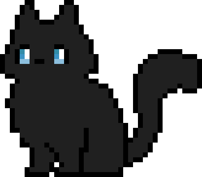

<div align="center">



<br/><br/>

<a href="https://git.io/typing-svg">
  
</a>

<br/><br/>

<a href="https://github.com/yhojandev">
  
</a>
<a href="mailto:yhojan5416@gmail.com">
  
</a>
<a href="https://linkedin.com/in/your-profile">
  
</a>

</div>

<br/>

<div align="center">
  
  
</div>

<br/>

<div align="center">
  
</div>

---

### `> about --me`


Desarrollador de software con interés en construir cosas útiles, limpias y bien pensadas.
Me gusta aprender tecnologías nuevas, resolver problemas reales y dejar el código más legible de lo que lo encontré.

- 🔭 Trabajando en proyectos personales y open source
- 🌱 Aprendiendo y profundizando en nuevas herramientas
- 💬 Pregúntame sobre desarrollo web, backend y buenas prácticas
- 📫 Contáctame por los enlaces de arriba

<br clear="right"/>

---

### `> cat stack.yaml`

```yaml
yhojandev:
  focus:
    - "Full-Stack Development"
    - "Clean Architecture"
    - "Open Source"

  languages:
    primary: [Python, JavaScript, TypeScript]
    exploring: [Rust, Go]

  backend:
    - FastAPI
    - Django
    - Node.js
    - PostgreSQL
    - MongoDB

  frontend:
    - React
    - Next.js
    - HTML / CSS
    - Tailwind

  tools:
    - Docker
    - Git / GitHub Actions
    - Linux
    - VS Code / Cursor

  currently:
    status: "building & learning"
    mood: "☕ + 🐾"
```

---

<div align="center">

<sub>// built with pixels, caffeine and curiosity</sub>

<br/><br/>


</div>
